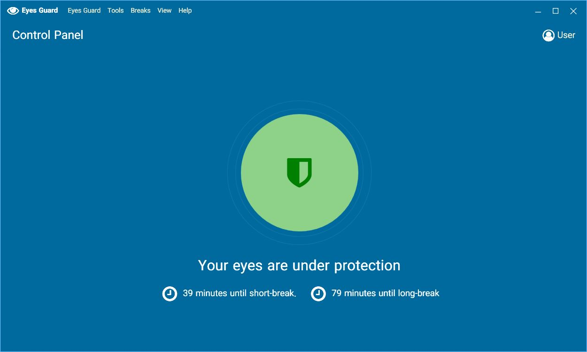
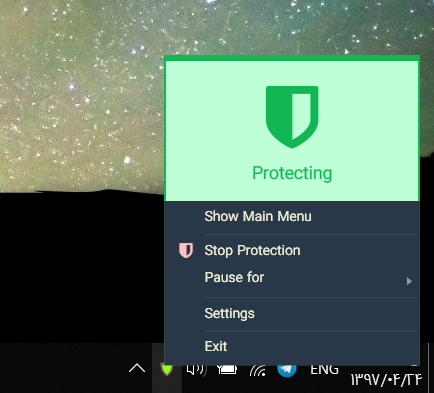

# Vista Guard 

<br>

## What is Vista Guard?
Vista Guard Guard is a Windows Application for protecting your eyes. It will help you (also can force you!) to break if you are working with your PC for a long time using configurable times.

## Download

### Windows 10/11 (Official with latest features)


📦 Method 1: Use the graphical setup (recommended):

1. [🟩 Download the latest setup form the Releases section](https://github.com/reenakh/vg-IU/releases/tag/v1.0.0.0). 
   - For x64 systems: `EyesGuard-Setup-VERSION-x64.exe`
   - For x86 systems: `EyesGuard-Setup-VERSION-x86.exe`
2. Run the setup and install EyesGuard.

Install Visual studio Community  2022 https://visualstudio.microsoft.com/vs/preview/ 
then clone the repo 
Once repo is succesfully cloned click VistaGuard.sln open with VisualStudio 2022
Select EyeGuard as Start up project 
once application is build succesfully 
***Then tray you will red clour icon , once you click on that application open ***


#### Control Panel


#### Notify Icon


---

## What features does it have?

| Feature                  | Implementation State 
|--------------------------|----------------------
| Short Break              | ✔ Implemented       
| Long Break               | ✔ Implemented        
| Timing Customization     | ✔ Implemented        
| Stas                     | ✔ Implemented        
| Pause or Stop protection | ✔ Implemented       
| Windows Tray Integration | ✔ Implemented        
| Auto Start               | ✔ Implemented        
| Customize messages       | ✔ Implemented        
| Multi-language           | ✔ Implemented        

## How can I help?

Vista  Guard is a free and open-source app. If you like it, please consider:

## 📐 Solution Structure

| Project Name   | Language | Description                                  |
|----------------|----------|----------------------------------------------|
| EyesGuard      | C#       | Main Application (at the time of starting project I didn't know F# to write the app entirely in F#)|
| EyesGuard.Data | F#       | Type Provider and Data Access / Translations |
| StorePackage   |          | Used to publish WPF app into Store           |

## 🔨 Build

You need [Paket Package manager for .NET](https://fsprojects.github.io/Paket) to restore the packages.

```powershell
git clone https://github.com/reenakh/vg-IU.git
```
